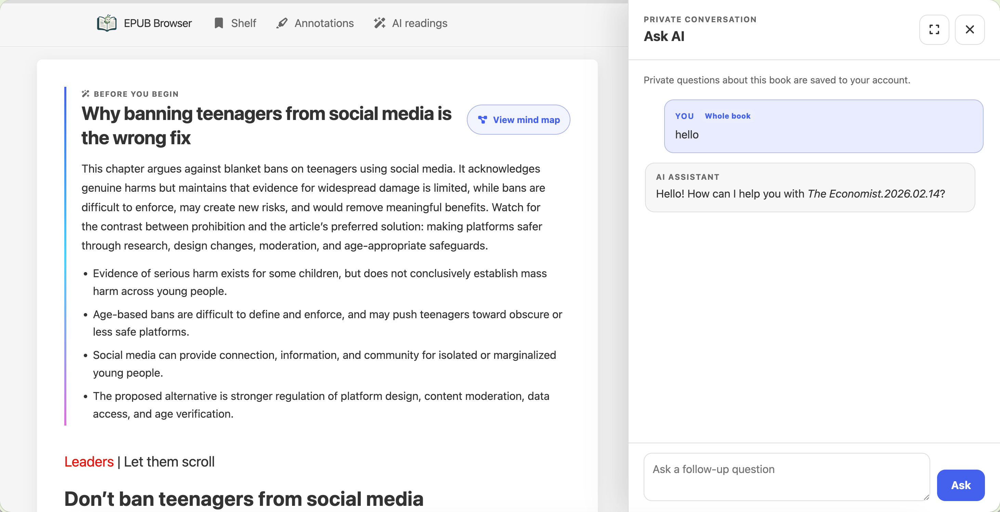

# EPUB Browser

> A private EPUB reading service and a self-contained static-site generator.

[English](https://github.com/dfface/epub-browser/blob/main/README.md) | [简体中文](https://github.com/dfface/epub-browser/blob/main/README.zh-CN.md)

<p align="center">
  
</p>

[](https://pypi.org/project/epub-browser/)
[](https://pypi.org/project/epub-browser/)
[](License.txt)

EPUB Browser has two explicit modes:

| | `ssg` | `server` |
| --- | --- | --- |
| Deployment | Static hosting, Pages, object storage, Nginx | A persistent private reading service |
| Accounts | None | Local accounts |
| Progress, annotations, bookshelf | This browser only | Authenticated account in SQLite |
| Source updates | Run `ssg` again | Restart or use `--watch` |
| Runtime database | None | Required |

Use `ssg` when the result must be ordinary static files. Use `server` when readers need accounts, cross-device data, access control, or automatic source reconciliation.

## AI-native reading (Server only)

**Turn an EPUB library into a source-aware learning workspace.** AI reading is
not a generic summary bolted beside a book. It builds a shared, reviewable
learning layer *on the original chapter*: a reading route before the text,
explanations exactly where evidence appears, a chapter mind map, and questions
that help the reader carry the argument forward.



### Read with the text, not away from it

- **Chapter guide and mind map**: Start with the chapter's central question,
  key claims, and a Mermaid mind map. The map opens only when wanted, so the
  book remains the primary surface.
- **Evidence-aware AI annotations**: AI highlights precisely quoted sentences.
  Select one to open a focused Markdown explanation below the passage rather
  than losing your place in a detached report.
- **Paragraph-role notes**: A compact, colour-coded `!` beside a paragraph
  explains why that paragraph matters to the chapter's reasoning or story.
- **Think further**: Finish with a small set of chapter-end prompts that turn
  passive reading into reflection.

<p align="center">
  
  
</p>

### Ask AI, without losing the book

The **Ask AI** drawer is a persistent private conversation for the current
chapter or the whole book. It keeps the reader's own history, retains exact
chapter scope, can use the book's shared learning layer as context, and renders
safe Markdown, KaTeX mathematics, and Mermaid diagrams locally. It is designed
for the moment a reader wants to challenge a claim, compare chapters, or follow
a thread—without navigating away from the page.

### Shared learning, governed by the library

Generated chapter layers are shared by readers who can access the book, cached
in SQLite, and processed as durable background tasks. The **AI readings** hub
collects those results by book, chapter, language, generated time, template, and
configuration version. Administrators can manage model access and results;
members can only manage their own eligible output. Every AI capability respects
the existing book-access rules.


AI reading is intentionally a **Server-mode feature**. Configure an
OpenAI-compatible provider and explicitly grant member access before enabling
it. SSG stays fully static and contains none of the AI controls, background
jobs, account data, or provider configuration. See the
[AI-native reading design](https://github.com/dfface/epub-browser/blob/008904e2dd913192367c34251a239cb8e8dff222/docs/ai-native-reading.md) and
[local rich-text renderer notes](https://github.com/dfface/epub-browser/blob/008904e2dd913192367c34251a239cb8e8dff222/docs/third-party-ai-renderers.md) for the
interaction model and safety boundary.

## Requirements and installation

- Python 3.9 or newer
- One or more `.epub` files, files in nested directories, or a Calibre-style library directory

Install from PyPI:

```bash
pip install epub-browser
```

Show the mode-specific command reference:

```bash
epub-browser --help
epub-browser ssg --help
epub-browser server --help
```

## Quick start

### Generate a static site

```bash
epub-browser ssg /path/to/books \
  --output-dir /path/to/dist
```

Serve `dist/` over HTTP. Opening generated pages directly through `file://` is not supported because browser storage, modules, manifests, and Service Workers require an HTTP origin.

For a site hosted below a URL prefix, set the public path separately from the filesystem destination:

```bash
epub-browser ssg /path/to/books \
  --output-dir /path/to/dist \
  --base-path /my-repository/
```

`--base-path` changes generated URLs, not where files are written. With `/my-repository/`, links, icons, manifests, book metadata, and Service Worker entries all use that prefix while the files remain directly inside `dist/`.

### Run a persistent Server library

```bash
epub-browser server /path/to/books \
  --server-dir /path/to/epub-browser-state \
  --watch
```

Open `http://127.0.0.1:8000/`. On first access, EPUB Browser prompts you to create the initial administrator. The library is not scanned or exposed until this one-time setup finishes.

## Sources and stable book identity

Every positional `SOURCE` may be an EPUB file or a directory. Directories are searched recursively. Multiple sources can be passed to one command:

```bash
epub-browser server book.epub /srv/library /srv/periodicals \
  --server-dir /srv/epub-browser \
  --watch
```

Each book receives a stable `book_id`, also exposed as `book_hash` in generated URLs and browser data. The general CLI default is:

```bash
--book-id-storage sidecar
```

Sidecar mode writes a visible identity file beside the EPUB, such as `BOOK.epub.epub-browser.json`, and leaves the EPUB bytes unchanged. The sidecar contains the stable ID and a verified SHA-256 source fingerprint.

To place the ID in OPF metadata instead, select embedded storage for the entire invocation:

```bash
--book-id-storage embedded
```

Embedded mode can rebuild the EPUB ZIP, so the source must be writable and safe to modify. EPUB Browser does not silently fall back to a database-only identity. It stops when IDs disagree, active sources duplicate an ID, a carrier is invalid, or a required carrier cannot be written.

When migrating storage modes, the existing ID is copied to the selected carrier; the other valid carrier is retained. An existing embedded ID from v2.0.4 is copied to the default sidecar without rewriting the EPUB.

## SSG mode

SSG builds a complete snapshot in a sibling staging directory, validates it, and then replaces the destination. If any conversion fails, the previous destination remains unchanged. Generated output contains no Server database, migration state, account page, or runtime cache metadata.

SSG behavior is intentionally local and account-free:

- Reading progress and annotations use browser storage on the current origin.
- The bookshelf supports local JSON Import and Export; it has no cloud Sync action.
- Login, account settings, Server APIs, and user-dependent controls are absent.
- The storage destination is fixed to local browser storage and is not presented as a setting.
- Static output includes the Service Worker required for offline-capable assets.

All required application JavaScript, CSS, fonts, and icons are included in the output. See [Self-contained and network behavior](#self-contained-and-network-behavior) for the only optional network request.

## Server mode

### Initial setup, accounts, and permissions

On a fresh persistent state directory, normal pages redirect to `/setup`. APIs, event streams, generated assets, and books return a setup-required response until the initial administrator is created. Complete setup over loopback or another trusted private path before exposing the port: the first successful setup submission claims the administrator account.

After setup:

- Public registration is closed. Administrators create and manage users.
- Accounts have either the `administrator` or `member` role.
- Ordinary books are visible to every authenticated account.
- Restricted books are visible only to administrators and explicitly selected users.
- Each user owns their bookshelf, progress, annotations, and active sessions.
- Users can change their password and revoke their sessions.
- Administrators can manage users, roles, passwords, sessions, and book grants.
- Sessions use an HttpOnly cookie, CSRF protection, and a 30-day sliding lifetime.

### Configure and govern AI reading

Administrators configure AI reading in **Administration**, immediately after
user management and before book management. The page stores an
OpenAI-compatible Base URL, API key, model, timeout, context budget,
concurrency cap, and default daily provider-call limit in the Server SQLite
database. AI starts disabled for members; an administrator must grant access per
member and may set an individual daily limit (`0` means unlimited).

Chapter learning layers and book-level reviews are shared per eligible language,
while follow-up conversations remain private to each account. Results, task
state, custom tags, book reading classification, and private follow-ups are
stored in SQLite. Old results remain available after a model configuration
change until an administrator explicitly regenerates them.

When a reader requests an AI guide or asks a question, selected EPUB text and
the compressed conversation context are sent to the configured external
provider. Do not enable the feature unless readers are permitted to send that
content to the provider. The API key is never returned to a browser or exposed
by an API; protect the Server state directory accordingly.

For unattended first start, provide a username and password file:

```bash
epub-browser server /path/to/books \
  --server-dir /path/to/state \
  --admin-username admin \
  --admin-password-file /run/secrets/epub-browser-admin-password \
  --no-browser
```

The password file should be mode `0600`. EPUB Browser removes one trailing newline, stores an Argon2id hash, and never prints the secret. An incomplete configuration, empty file, or unreadable file stops startup. Once setup is complete, subsequent starts do not read the bootstrap secret.

Environment equivalents are `EPUB_BROWSER_ADMIN_USERNAME` and `EPUB_BROWSER_ADMIN_PASSWORD_FILE`. `EPUB_BROWSER_ADMIN_PASSWORD` is a plaintext fallback only when no password file is configured. A CLI password-file path has priority over environment password sources.

### Browser launch and logging

By default, Server tries to open the operating system's default browser after the HTTP listener has started. `--no-browser` prevents that local launch. It **does not disable the web interface or browser access**; it only suppresses the local `webbrowser.open(...)` call. Use it for Docker, systemd, SSH sessions, headless machines, and scripts.

Without `--log`, the CLI avoids routine output so terminal progress displays are not corrupted. An interactive terminal prints the bound URL once; non-interactive Docker and service runs remain quiet. `--log` enables operational and HTTP access logging.

Initial and watch scans appear in the web interface rather than terminal `tqdm`. A successful summary closes automatically; failures stay visible until dismissed. With `--watch`, fixing or replacing a source starts another scan without a manual retry action.

### Persistent and ephemeral state

Persistent Server mode requires `--server-dir`. For a disposable run, use `--ephemeral` instead:

```bash
epub-browser server book.epub --ephemeral
```

Ephemeral state is deleted at shutdown. Because its database is new on every run, setup also repeats unless unattended bootstrap credentials are supplied.

Persistent layout:

```text
<server-dir>/
├── .server.lock                 # reusable process-lock metadata
├── data/
│   ├── epub-browser.db          # authoritative accounts, books, grants, reading data
│   ├── migration-state.json     # restart-safe migration state
│   └── backups/                 # verified pre-migration database copies
└── cache/
    ├── catalog.json             # generated-cache status
    ├── public/                  # served application and converted books
    └── staging/                 # replaceable conversion work
```

Only `data/` is authoritative. `cache/` may be deleted and will be rebuilt. Preserve `data/` across upgrades and container replacement. An operating-system lock controls exclusivity; `.server.lock` may remain after a normal shutdown as diagnostic metadata.

Store persistent `data/epub-browser.db` on a local filesystem. Shared or network filesystems are unsupported for WAL concurrency. Verified backups remain under `data/backups/` and include all committed WAL data.

### LAN and reverse proxy

Server binds to `127.0.0.1:8000` by default. For a trusted LAN:

```bash
epub-browser server /path/to/books \
  --server-dir /path/to/state \
  --watch \
  --host 0.0.0.0 \
  --port 8080 \
  --no-browser
```

Do not expose the built-in HTTP server directly to the public internet. Terminate TLS at a reverse proxy, apply network controls, and enable secure cookies.

To record real client IPs in active sessions and login-rate limits behind a reverse proxy, configure its **direct socket network** (not public client ranges):

```bash
epub-browser server /path/to/books \
  --server-dir /path/to/state \
  --watch \
  --host 0.0.0.0 \
  --trusted-proxy-cidr 172.32.11.1/32 \
  --trusted-proxy-cidr 10.42.0.0/16 \
  --cookie-secure \
  --no-browser
```

Repeat `--trusted-proxy-cidr` once for each direct proxy address or network. Only requests whose direct peer belongs to one of these CIDRs can supply `X-Forwarded-For`; all other peers record only their direct address. Uvicorn forwarded-address processing is disabled, so `Forwarded` and `FORWARDED_ALLOW_IPS` cannot expand this trust boundary. Use `--cookie-secure` only when the browser reaches the service through HTTPS.

## Docker

The image runs persistent Server mode with these defaults:

- `/app/Library` as the source
- `/app/EpubBrowserFiles` as persistent state
- `--watch`
- `--no-browser`
- `--host 0.0.0.0 --port 80`
- `--book-id-storage embedded`

Because embedded identity may rewrite an EPUB, mount the library read-write. Mount Server state read-write and keep it across container replacement:

```bash
docker run -d \
  --name epub-browser \
  -p 127.0.0.1:8080:80 \
  -v /path/to/books:/app/Library:rw \
  -v /path/to/epub-browser-state:/app/EpubBrowserFiles \
  epub-browser:2.3.3
```

Visit `http://127.0.0.1:8080/setup` before changing the port binding or proxy rules.

### Docker Compose

The repository includes a [docker-compose.yml](docker-compose.yml) for users who prefer Compose. From a checkout, create `Library/`, put EPUB files there, then run:

```bash
docker compose up -d --build
```

It publishes only `127.0.0.1:8080`, keeps source EPUBs in `./Library`, and persists Server state in `./EpubBrowserFiles`. The complete Server `command` is intentionally visible in the file, so deployment-specific flags can be added without replacing an implicit image default. Complete the one-time setup at `http://127.0.0.1:8080/setup`. For remote access, keep this loopback binding and place an authenticated TLS reverse proxy in front of it.

For unattended setup:

```bash
docker run -d \
  --name epub-browser \
  -p 127.0.0.1:8080:80 \
  -v /path/to/books:/app/Library:rw \
  -v /path/to/epub-browser-state:/app/EpubBrowserFiles \
  -e EPUB_BROWSER_ADMIN_USERNAME=admin \
  -e EPUB_BROWSER_ADMIN_PASSWORD_FILE=/run/secrets/epub-browser-admin-password \
  --mount type=bind,src=/path/to/admin-password,dst=/run/secrets/epub-browser-admin-password,readonly \
  epub-browser:2.3.3
```

After the first successful start, the one-time secret mount may be removed. A read-only library works only when every EPUB already contains a matching valid embedded ID. Existing sidecars are retained when their IDs are embedded.

Mount `/app/SyncData:ro` only while importing legacy bookshelf JSON:

```bash
-v /path/to/legacy-sync:/app/SyncData:ro
```

The loopback published port in the examples keeps the container behind the host boundary. For remote access, use a TLS reverse proxy, configure its actual container-network CIDR, and add `--cookie-secure`.

## Complete command reference

### `epub-browser ssg SOURCE [SOURCE ...]`

| Option | Meaning |
| --- | --- |
| `--output-dir DIR`, `-o DIR` | Required destination for the atomic static snapshot. |
| `--base-path PATH` | Public URL prefix; default `/`. It must begin and end with `/`. |
| `--book-id-storage sidecar\|embedded` | Stable identity carrier for every selected source; default `sidecar`. |
| `--log` | Print conversion detail. Without it, routine output stays quiet. |

### `epub-browser server SOURCE [SOURCE ...]`

Exactly one of `--server-dir` and `--ephemeral` is required.

| Option | Meaning |
| --- | --- |
| `--server-dir DIR` | Persistent authoritative data and replaceable cache root. |
| `--ephemeral` | Use disposable state; mutually exclusive with `--server-dir`. |
| `--watch`, `-w` | Watch sources and reconcile additions, updates, moves, and deletions. |
| `--host ADDRESS` | Bind address; default `127.0.0.1`. |
| `--port PORT`, `-p PORT` | Bind port; default `8000`. |
| `--no-browser` | Do not launch the local default browser. The web UI remains available. |
| `--log` | Enable operational and HTTP access logs. |
| `--legacy-sync-dir DIR` | Read legacy bookshelf JSON during startup migration. |
| `--book-id-storage sidecar\|embedded` | Stable identity carrier for every selected source; default `sidecar`. |
| `--admin-username NAME` | Initial unattended administrator; fallback `EPUB_BROWSER_ADMIN_USERNAME`. |
| `--admin-password-file FILE` | Preferred initial secret file; fallback `EPUB_BROWSER_ADMIN_PASSWORD_FILE`, then `EPUB_BROWSER_ADMIN_PASSWORD` when no file is set. |
| `--trusted-proxy-cidr CIDR` | Repeatable direct-proxy network trust boundary for safe `X-Forwarded-For` client-IP parsing. |
| `--cookie-secure` | Send the session cookie only over browser-facing HTTPS. |

### Legacy v1 syntax

Legacy syntax is supported throughout the v2 major line:

| v1 command | v2 mapping |
| --- | --- |
| `epub-browser BOOKS` | `epub-browser server BOOKS --ephemeral` |
| `epub-browser BOOKS --output-dir STATE` | `epub-browser server BOOKS --server-dir STATE` |
| `epub-browser BOOKS --no-server --output-dir DIST` | `epub-browser ssg BOOKS --output-dir DIST` |
| `--sync-dir DIR` | `server --legacy-sync-dir DIR` |

Legacy-only `--keep-files` retains a temporary Server directory. Persistent Server directories are already permanent. With `--log`, the compatibility adapter prints the equivalent v2 command; otherwise it remains quiet.

## Reading features and data placement

- Recursive EPUB and Calibre-library discovery, metadata tags, search, and pinyin search
- Responsive Library, book detail, and chapter-reading interfaces
- Scrolling, page turning, continuous reading, adjustable content width, fonts, custom CSS, themes, and pure reading mode
- Highlights, notes, annotation browsing, nested bookshelf groups, tags, and JSON Import/Export
- English and Simplified Chinese interfaces
- E-reader-friendly behavior for Kindle/Silk browsers; browser-heavy features may be reduced

| Data | SSG | Server |
| --- | --- | --- |
| Reading progress | Browser-local | Authenticated user's SQLite record |
| Highlights and notes | Browser-local | Authenticated user's SQLite records |
| Bookshelf | Browser-local; Import/Export | Authenticated user's versioned cloud document; automatic save |
| Accounts and sessions | Not present | SQLite under `<server-dir>/data` |
| Book grants | Not present | SQLite under `<server-dir>/data` |

Server does not offer a local/cloud storage selector: authenticated reading data is always stored on the Server. SSG never probes Server APIs and always uses the current browser origin's local storage.

## Self-contained and network behavior

The application is self-contained for reading: required JavaScript, CSS, fonts, icons, manifests, and converted EPUB resources are served locally. There are no CDN runtime dependencies. Blocking outbound internet access does not prevent setup, login, browsing, reading, annotations, progress, bookshelf use, administration, or source conversion.

The footer may make an optional request to the GitHub Releases API to discover a newer EPUB Browser version. Failure, blocking, or offline use only suppresses that update hint.

SSG publishes a static Service Worker. Server deliberately disables and retires the origin-wide Service Worker so one account cannot receive another account's cached protected content.

## Data safety and migration

Before upgrading persistent Server installations, back up the source EPUBs and `<server-dir>/data`. Keep the same persistent state volume during container replacement.

Startup migration is automatic and restart-safe. It verifies legacy databases, creates a backup, upgrades a copy, imports eligible legacy bookshelf/progress/annotation data into the pending initial administrator, and retires only replaceable legacy public artifacts after successful checkpoints. Ordinary requests never scan legacy sync directories. Corrupt databases, invalid password hashes, ambiguous legacy databases, and conflicting IDs fail closed instead of being guessed or overwritten.

A migrated root `epub-browser.db` or `annotations.db` is retained as a sensitive, non-authoritative recovery copy; `data/epub-browser.db` is authoritative and Server requests do not use the retained root file. Keep the recovery copy private. Remove it manually only while Server is stopped, after verifying the authoritative database and recorded backup, and only when v1 rollback is no longer needed. EPUB Browser never deletes it automatically.

If both `epub-browser.db` and `annotations.db` exist at a legacy root, startup stops and leaves them untouched. See [Migrating to v2](docs/migration-v2.md) for backup, rollback, cache rebuilding, and conflict recovery.

## Troubleshooting

### The command started, but no browser opened

Remove `--no-browser` when running on a graphical local machine, or open the printed/bound URL manually. In Docker, systemd, SSH, and non-interactive sessions, opening the URL yourself is expected.

### The CLI appears quiet

Quiet operation is intentional without `--log`, especially in non-interactive environments. Add `--log` for operational and access detail. Server scan progress is shown in the web interface.

### Docker cannot write a stable ID

The image defaults to embedded identity. Mount `/app/Library` read-write or pre-embed valid matching IDs. Use a custom command with `--book-id-storage sidecar` only if a writable sidecar carrier is preferable.

### A generated SSG site has broken links below a subpath

Regenerate it with a normalized `--base-path`, such as `/reader/`, and configure the static host to serve the output at that same prefix.

### Server refuses to start after an upgrade

Read the first logged migration or validation error, preserve the data and source files, and consult [docs/migration-v2.md](https://github.com/dfface/epub-browser/blob/008904e2dd913192367c34251a239cb8e8dff222/docs/migration-v2.md). Do not delete the authoritative `data/` directory to work around an error.

## Contributing

Issues and pull requests are welcome at [dfface/epub-browser](https://github.com/dfface/epub-browser). A useful report includes the exact command, browser/device, reproduction steps, relevant logs, and the EPUB when it can be shared legally.

## License

[MIT](License.txt)
