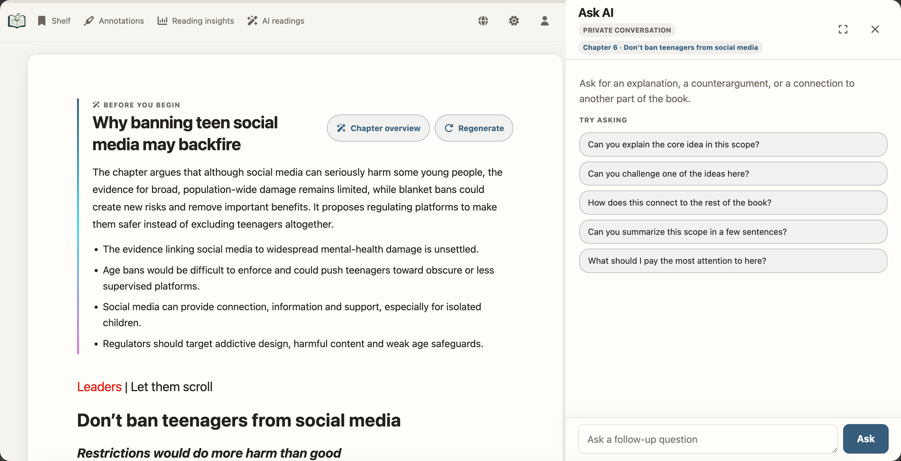
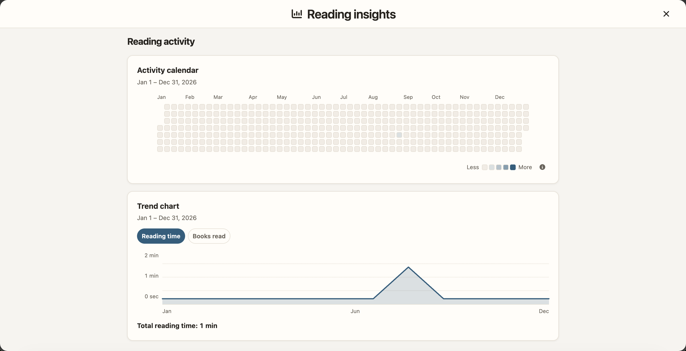

# EPUB Browser

> EPUB dan PDF dalam perpustakaan baca pribadi atau sebagai situs statis mandiri.

**README:** [English](../../README.md) | [简体中文](README.zh-CN.md) | [繁體中文](README.zh-TW.md) | [日本語](README.ja.md) | [한국어](README.ko.md) | [Español](README.es.md) | [Deutsch](README.de.md) | [Français](README.fr.md) | [Русский](README.ru.md) | [Italiano](README.it.md) | [Português (Brasil)](README.pt-BR.md) | [العربية](README.ar.md) | [Bahasa Indonesia](README.id.md) | [हिन्दी](README.hi.md) | [Tiếng Việt](README.vi.md) | [ไทย](README.th.md) | [Bahasa Melayu](README.ms.md)

**Bahasa antarmuka (17):** Inggris, Tionghoa Sederhana, Tionghoa Tradisional, Jepang, Korea, Spanyol, Jerman, Prancis, Rusia, Italia, Portugis Brasil, Arab, Indonesia, Hindi, Vietnam, Thai, dan Melayu.

[](https://pypi.org/project/epub-browser/)
[](https://pypi.org/project/epub-browser/)
[](../../License.txt)


EPUB Browser memproses `.epub` dan `.pdf` dalam dua mode dengan tanggung jawab yang dipisahkan dengan jelas:

| | `ssg` | `server` |
| --- | --- | --- |
| EPUB dan PDF | Ya | Ya |
| Penerapan | Hosting statis, Pages, penyimpanan objek, Nginx | Layanan membaca pribadi yang persisten |
| Akun | Tidak ada | Akun lokal |
| Login tunggal OIDC | Tidak disertakan | Provider generik, penautan akun yang ada, dan pembuatan anggota opsional |
| Kemajuan, anotasi, rak buku | Hanya di peramban ini | Data akun yang masuk di SQLite |
| Pembaruan sumber | Jalankan `ssg` lagi | Mulai ulang layanan atau gunakan `--watch` |
| Basis data runtime | Tidak ada | Wajib |

PDF adalah format buku kelas utama: halaman 1 menjadi `chapter_0.html`, setiap halaman tercantum dalam daftar isi, dan PDF.js lokal merendernya dalam perpustakaan, halaman buku, antarmuka membaca, pencarian, serta alur anotasi yang sama. Fitur PDF yang tidak didukung seperti membaca dengan AI disembunyikan secara eksplisit, dan tidak ada CDN yang diperlukan saat membaca.

Gunakan `ssg` untuk menerbitkan berkas statis biasa. Gunakan `server` bila Anda memerlukan akun, data lintas perangkat, kontrol akses buku, atau pemantauan sumber otomatis.

## Ikhtisar

### Mengapa memilih EPUB Browser?

- **Membaca dengan AI yang menyatu dengan teks (khusus Server dan EPUB):** Dalam mode Server, panduan bab, penjelasan yang terhubung ke bukti, peta pikiran, pertanyaan refleksi, dan percakapan Ask AI privat tetap berada di samping teks asli EPUB—bukan menjadi ringkasan umum yang terpisah.
- **Wawasan membaca pribadi (khusus Server):** Lihat durasi membaca aktif, kalender aktivitas, tren, sesi, dan buku yang paling sering dibaca. Semua wawasan hanya terlihat oleh akun yang sedang masuk.



*Panduan AI dan pertanyaan privat tetap terhubung dengan teks asli.*



*Wawasan membaca mengubah waktu membaca aktif menjadi riwayat pribadi yang mudah dipahami.*

### Tumpukan teknologi

Antarmuka menggunakan HTML semantik, CSS, dan Vanilla JavaScript tanpa framework SPA. CLI dan Server memakai Python 3.9+, Starlette, Uvicorn, dan SQLite; pypdf, pypdfium2, serta PDF.js memproses PDF secara lokal tanpa CDN saat runtime.

### Demo

- **Mode SSG**: [epub-browser-test.yuhan.tech](https://epub-browser-test.yuhan.tech/)
- **Mode Server**: [epub.yuhan.tech](https://epub.yuhan.tech/) — nama pengguna dan kata sandi: `demo`.

### Membaca dengan AI secara native (khusus Server)

Fitur membaca dengan AI membangun lapisan pembelajaran bersama yang dapat ditinjau langsung di atas teks asli, bukan menempatkan ringkasan umum di samping buku. Lapisan ini mencakup rute sebelum membaca, ikhtisar bab sesuai kebutuhan, penjelasan yang terhubung ke kutipan, catatan tentang peran paragraf, penjelasan kosakata, uraian sederhana di akhir, dan pertanyaan untuk pemikiran lanjutan.

Hasil dibuat sebagai tugas latar belakang, disimpan di SQLite, dan dibagikan kepada pembaca yang dapat mengakses buku. Percakapan lanjutan tetap pribadi untuk setiap akun. Administrator harus mengatur penyedia yang kompatibel dengan OpenAI dan memberi izin kepada setiap anggota. Teks EPUB yang dipilih dikirim ke penyedia tersebut, jadi aktifkan fitur ini hanya dengan persetujuan pembaca. Keluaran SSG tidak pernah menyertakan akun, kontrol AI, tugas, atau konfigurasi penyedia.

## Memulai

### Persyaratan dan pemasangan

- Python 3.9 atau yang lebih baru
- Satu atau beberapa berkas `.epub` atau `.pdf`, direktori buku bertingkat, atau perpustakaan bergaya Calibre

Pemasangan dari PyPI mendukung mode SSG dan Server:

```bash
pip install epub-browser

# Bantuan lengkap untuk setiap mode
epub-browser --help
epub-browser ssg --help
epub-browser server --help
```

Untuk Server persisten dengan Docker, gunakan image yang diterbitkan; host tidak memerlukan Python:

```bash
docker pull dfface/epub-browser:latest
```

### Mulai cepat

#### Membuat situs statis

```bash
epub-browser ssg /path/to/books \
  --output-dir /path/to/dist
```

Sajikan `dist/` melalui HTTP; jangan buka halaman yang dihasilkan secara langsung dengan `file://`. Untuk menerapkan di bawah subjalur, tambahkan `--base-path /repositori-saya/`; opsi ini mengubah URL yang dihasilkan, bukan direktori keluaran.

#### Menjalankan perpustakaan Server persisten

```bash
epub-browser server /path/to/books \
  --server-dir /path/to/epub-browser-state \
  --watch
```

Buka `http://127.0.0.1:8000/`. Pada kunjungan pertama, buat administrator awal; perpustakaan tidak dipindai atau diterbitkan sebelum penyiapan selesai. `--no-browser` hanya mencegah layanan membuka peramban lokal secara otomatis.

## Data dan operasi

### Data, akun, dan batas akses

Setiap buku memiliki `book_id` yang stabil. Secara default, `--book-id-storage sidecar` menyimpan identitas di samping berkas sumber tanpa mengubah byte-nya. Untuk EPUB, `--book-id-storage embedded` menuliskannya ke metadata OPF; untuk PDF pengaturan ini selalu kembali ke sidecar yang berdekatan.

Dalam mode Server, `--server-dir` adalah lokasi otoritatif untuk SQLite, cache, dan cadangan migrasi. Akun, rak buku, kemajuan membaca, anotasi, hasil AI, dan tugas juga disimpan di sana. Administrator mengelola pengguna, peran, sesi, dan izin buku; anggota hanya menggunakan buku yang diizinkan dan data pribadi mereka sendiri. Lindungi izin direktori ini beserta cadangannya.

### Docker, proksi terbalik, dan dokumentasi lengkap

Dalam kontainer, pasang buku sebagai hanya-baca dan `--server-dir` pada volume persisten. Terima header proksi hanya dari proksi tepercaya dan gunakan HTTPS untuk penerapan publik.

Untuk Docker Compose, semua opsi CLI, migrasi, LAN, proksi terbalik, dan pemecahan masalah, lihat [README lengkap berbahasa Inggris](../../README.md) atau [README lengkap berbahasa Tionghoa Sederhana](README.zh-CN.md). Perilaku kedua mode sama dalam semua bahasa.

## Pengembangan dan lisensi

### Kontribusi dan lisensi

Issues dan Pull Requests dipersilakan. Lihat [License.txt](../../License.txt) untuk lisensi.
