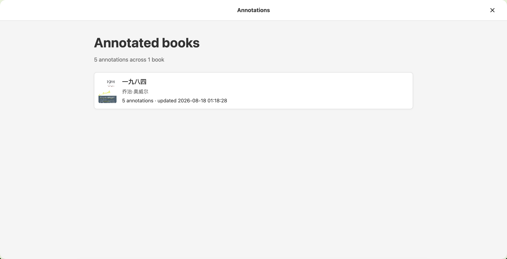
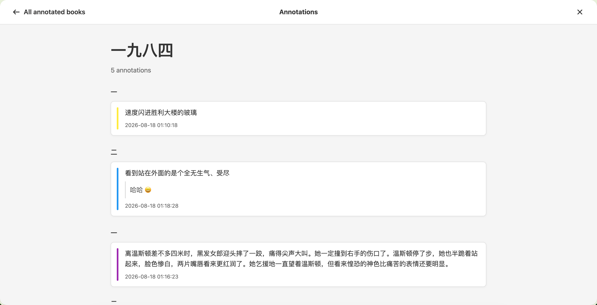

# EPUB Browser v1.11.0

发布日期 / Release date: 2026-08-18

## 中文

这是一个让标注回顾更自然、更易回到原文的功能版本。

### 新功能

- **全屏标注面板**：在书库点击“标注”，即可查看所有有标注的书；在单本书目录中点击“标注”，可直接回顾该书全部标注，无需离开当前页面。
- **按阅读顺序回顾**：单书标注按目录章节和原书顺序分组。每条标注会显示原文、笔记、高亮颜色与精确时间；点击即可回到对应章节并聚焦原文。
- **同时支持静态与服务端书库**：Build 模式继续读取浏览器本地标注；Server 模式尊重当前选择的本地或云端存储，并沿用现有用户隔离规则。

### 改进与修复

- **章节标题更准确**：标注面板现在正确读取书籍的 `toc.json`，显示实际章节名称而不是通用的“Chapter N”。
- **面板控制更清晰**：返回与关闭按钮固定在全屏面板两侧；支持 Escape、点击遮罩关闭，并恢复原页面的滚动位置和键盘焦点。
- **标注加载状态更明确**：标注面板在读取本地或云端数据时显示加载指示；空状态、错误状态与重试入口仍保持清晰可见。
- **时间格式统一**：标注和最近更新时间统一显示为 `yyyy-mm-dd hh:mm:ss`。
- **笔记不再改写正文**：带笔记的高亮不再在阅读原文末尾附加表情符号；笔记仍只在标注交互和标注面板中展示。
- **阅读操作更简洁**：有阅读进度时，Continue reading 的组合菜单提供简洁的 **Clear** 操作；确认后才清除进度，尚未开始阅读的书不显示该操作。
- **目录返回更直接**：阅读页的书籍目录面板在关闭按钮左侧提供 **Book home**，可直接回到当前书籍首页。

### 界面预览

**所有有标注的书**

**单书标注回顾**

### 兼容性

无需迁移。已有本地 IndexedDB 标注和云端标注均可继续使用。

## English

This feature release makes reviewing annotations more natural and makes it easy to return to the original passage.

### New Features

- **Full-screen annotation panel**: Open **Annotations** from the library to see every annotated book, or open it from a book's table of contents to review that book without leaving the current page.
- **Reading-order review**: Annotations are grouped by the book's table of contents and original reading order. Each entry shows the excerpt, note, highlight color, and precise timestamp; selecting it returns to and focuses the source passage.
- **Static and server-mode support**: Static builds continue to use browser-local annotations. Server mode respects the selected local or cloud store and keeps the existing per-user isolation.

### Improvements and Fixes

- **Accurate chapter names**: The panel now reads each book's `toc.json` and displays the real chapter title instead of a generic “Chapter N”.
- **Clearer panel controls**: Back and close controls stay at opposite sides of the full-screen panel. Escape and backdrop clicks close it while restoring the prior scroll position and keyboard focus.
- **Explicit annotation loading feedback**: The annotation panel shows a loading indicator while local or cloud data is being read, while empty, error, and retry states remain clear.
- **Consistent timestamps**: Annotation and latest-update times now use `yyyy-mm-dd hh:mm:ss`.
- **Notes no longer alter the text**: Highlights with notes no longer append an emoji to the reading text. Notes remain available from annotation interactions and the annotation panel.
- **Tidier reading actions**: When a book has reading progress, the Continue reading split menu provides a compact **Clear** action. Progress is cleared only after confirmation, and the action is hidden before reading has started.
- **Direct book-home navigation**: The book table-of-contents panel now places **Book home** to the left of Close, returning directly to the current book’s home page.

### Compatibility

No migration is required. Existing local IndexedDB and cloud annotations continue to work.
