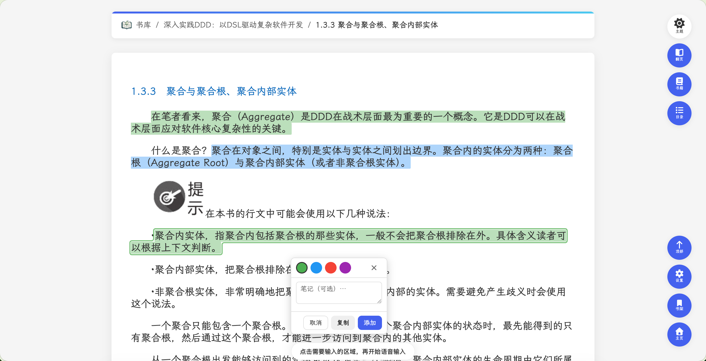

# EPUB Browser v1.11.4

发布日期 / Release date: 2026-08-18

## 中文

这是一个完善阅读器交互细节和中英文体验的维护版本。

### 修复与改进

- **继续阅读菜单等宽**：清除阅读进度的下拉菜单现在始终与“继续阅读”分段按钮整体等宽；切换 English 或简体中文后会随按钮文字自动调整，不再被菜单内容撑宽。
- **颜色设置提示本地化**：标注设置中的“点击颜色即可设为默认颜色”和“拖动颜色可调整顺序”现在会随界面语言显示中文或英文，不再混入固定英文提示。
- **回归保护**：增加了继续阅读菜单宽度和标注颜色提示的自动化覆盖，防止后续界面更新破坏语言一致性。

### 示例

## English

This maintenance release refines reader interactions and bilingual UI polish.

### Fixes and Improvements

- **Continue-reading menu alignment**: The clear-progress menu now always matches the full split-button width of “Continue reading”. It automatically adapts when switching between English and Simplified Chinese instead of being sized by its own content.
- **Localized color-setting hints**: Annotation settings now localize the “set default color” and “drag to reorder” hints, so the Chinese interface no longer exposes fixed English tooltip text.
- **Regression coverage**: Automated checks now protect the continue-reading menu width and annotation-color hint localization.

### Example

