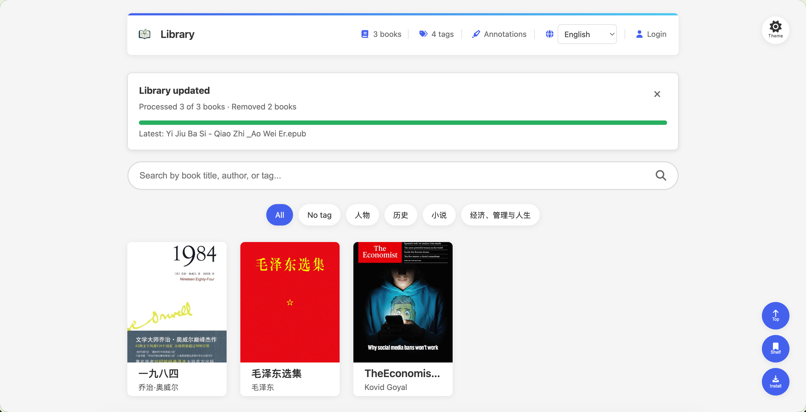

# EPUB Browser v2.0.1

发布日期 / Release date: 2026-08-19

## 中文

这是一个提升 Server 书库更新可见性与可靠性的维护版本。

### 新功能与改进

- **书库更新进度面板**：Server 会在网页中显示扫描、转换、复用、删除与完成状态；书目会在单本完成后增量出现，无需等待整批 EPUB 处理结束。
- **更新结果由你关闭**：已完成或带失败的结果会保留在页面上，便于核对；首次打开已经完成的书库仍保持安静，不会要求每次关闭提示。
- **删除数量更准确**：连续的文件变更会合并为一次 watch 对账。删除多本书时，面板会显示实际移除总数，而不是只显示最后一本或“处理 0/0”。
- **完整中英文体验**：进度标题、摘要、失败详情与关闭操作会跟随界面语言；在页面打开时切换语言也会立即更新。
- **Docker 持续监听**：官方镜像继续以 `--watch` 启动，挂载的 EPUB 目录发生变化后会自动更新书库。

### 修复

- 修复 SSE 短暂断线后进度面板停留在“正在重新连接”、只有刷新页面才能看到最新书库的情况。

### 示例

### 兼容性

- 不需要数据迁移。现有 Server 数据、书籍 ID、标注、阅读进度和书架同步记录保持兼容。
- 升级 Docker 镜像后保留原有 `/app/EpubBrowserFiles` 挂载即可；EPUB 输入目录仍建议以只读方式挂载。

## English

This maintenance release makes Server library updates more visible and reliable.

### New Features and Improvements

- **Library update progress panel**: Server pages now show discovery, conversion, reuse, deletion, and completion. Books appear incrementally as they finish instead of waiting for the entire EPUB batch.
- **Results stay until you close them**: Successful and degraded update summaries remain available for review, while a page opened after a completed scan stays quiet.
- **Accurate deletion totals**: Related file changes are reconciled as one watch batch. Removing several books reports the actual total instead of only the last file or a misleading “0 of 0”.
- **Fully localized progress UI**: Progress titles, summaries, failure details, and the close action follow the selected language and update immediately when the language changes on an open page.
- **Continuous Docker watching**: The official image continues to start with `--watch`, so changes in the mounted EPUB directory automatically update the library.

### Fixes

- Fixed an issue where a short SSE interruption could leave the panel on “Reconnecting” and require a page refresh before the latest library state appeared.

### Example

### Compatibility

- No data migration is required. Existing Server data, book IDs, annotations, reading progress, and synchronized bookshelf records remain compatible.
- When upgrading the Docker image, retain the existing `/app/EpubBrowserFiles` mount; EPUB input should still be mounted read-only where possible.
