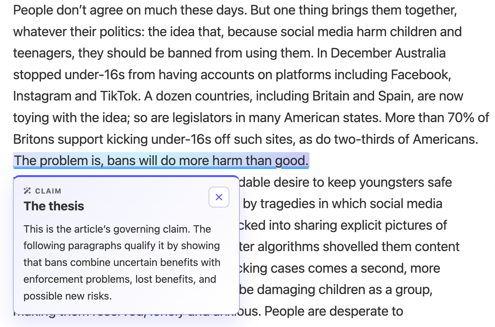
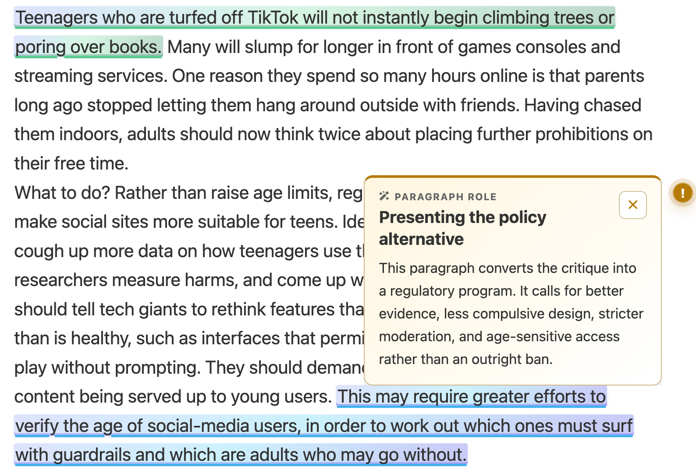
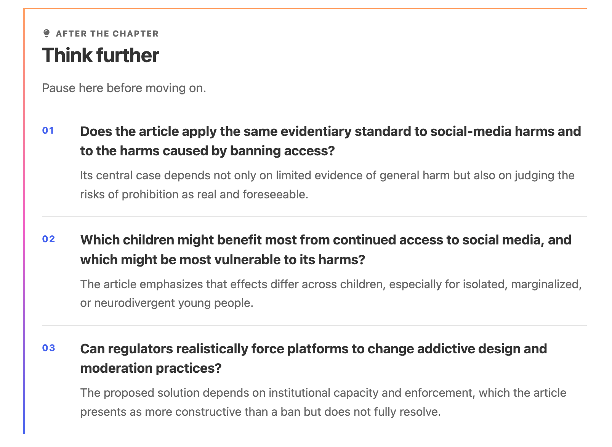
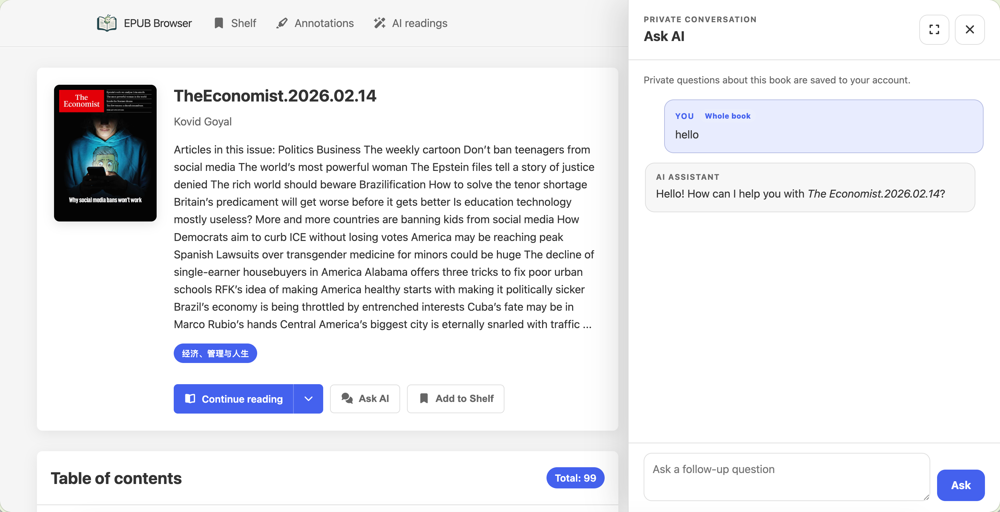
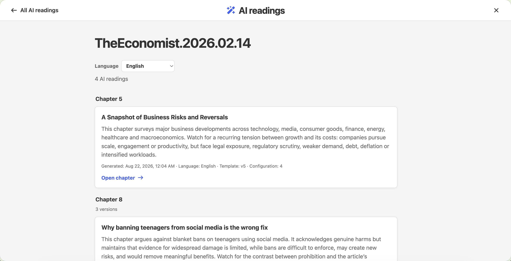

# EPUB Browser v2.2.0 — AI-native reading

发布日期 / Release date: 2026-08-22

## 中文

**v2.2.0 把 EPUB Browser 的 Server 模式从“能打开 EPUB 的私有书库”，升级为“贴着
原文、带着证据一起学习的阅读空间”。** AI 不再是离开正文后才看到的一份摘要；它可以在
正确的位置给出阅读路线、解释关键句、提示段落作用、画出思维导图，并在读完后邀请你继续
思考。与此同时，Ask AI 保留为私有、可持续的深度对话。

> AI 阅读仅存在于 **Server 模式**。SSG 仍是无账户、无数据库、无 AI 控件或 Provider
> 配置的自包含静态站点。

### 让 AI 留在原文里

- **章前导读**：每章开头先给出核心问题、阅读路线、关键线索和可展开的 Mermaid 思维导图，帮助读者先建立结构再进入细读。
- **精确原文标注**：AI 只为能定位到原文的引句生成标注。点击高亮会在下方弹出 Markdown 透视卡，解释概念、主张、证据、转折或问题，而不会把读者带进脱离上下文的侧注。
- **段落作用便利贴**：段落旁的彩色 `!` 是一张按需打开的便利贴，说明这一段在论证或叙事中的作用；正文保持干净，AI 只在读者需要时出现。
- **主题化 AI 划线**：AI 标注使用带主题色和辅助色的渐变高亮，让来源于 AI 的阅读线索一眼可辨，同时保留原文优先级。
- **章末深入思考**：正文结束后提供少量可继续推敲的问题和分析角度，帮助读者把“看完”变成“理解过”。

  
  

### Ask AI：跟着阅读进度追问

- **私有、持久、精确分章**：在书籍页或章节页打开 Ask AI；问题与回答只对自己的账户可见，并保存在 SQLite。每条问题带有当前章节或整书范围，下一次打开会自动定位到最近的回答。
- **真正有上下文的对话**：请求会带入当前书籍信息、明确的章节文本、适用的共享学习层，以及本账户的历史问答。服务端会按模型上下文窗口、聊天预算和回答预留空间压缩上下文，而不是无限堆叠内容。
- **富文本回答**：对话与导读统一支持安全 Markdown、本地 KaTeX 公式和本地 Mermaid 图形；不加载第三方 CDN，不执行模型返回的 HTML 或脚本。
- **后台任务与恢复**：生成与追问均以 SQLite 中的持久任务执行；关闭抽屉、刷新页面或重启服务不会无故丢失任务。同一书籍、章节、语言、策略、模板与模型配置的共享学习层由全局锁去重，追问仍可独立排队。

### 一套可治理的共享 AI 阅读层

- **AI 阅读汇总**：导航栏新增 AI 阅读入口。它只汇总当前用户有权访问的书籍，按书籍、章节和语言分组展示共享结果，并显示生成时间、模板版本和模型配置版本。
- **版本可追溯、可选择**：同一章节保留历史结果版本。读者按界面语言查看匹配结果，管理员可以选择或清理版本；成员仅可清理自己有权管理的结果。
- **书籍与目录联动**：生成过共享阅读层的章节会在书籍目录、章节目录与 AI 阅读汇总中得到一致标记；从汇总能直接回到对应章节。
- **章节索引忠实呈现**：AI 阅读、任务进度、问答范围和汇总页直接显示保存的 `chapter_index`；索引 `0` 即“第 0 章”，索引 `7` 即“第 7 章”，不会再产生人为偏移。
- **服务端治理**：管理员在“用户管理”之后、“书籍管理”之前配置 OpenAI-compatible Provider、模型、超时、模型上下文窗口、聊天上下文预算、并发量与默认每日限制；成员默认禁用，需由管理员明确授予权限。
- **结果可复用**：共享层、书籍 AI 分类、服务端标签和任务状态全部保存在 SQLite。模型配置升级后既有结果仍可阅读，只有显式重新生成才会产生新版本。

### 兼容性与升级

1. **AI 阅读需要配置并授权。** 升级后管理员应在管理后台配置 Provider，并为需要的成员授予 AI 阅读权限。启用前请确认 EPUB 内容可以发送给所选择的外部 AI Provider。
2. **Server 缓存会按需重建，SQLite 数据保留。** v2.2.0 的 Server 使用 EPUB 派生内容缓存配合动态页面外壳，以便界面、国际化、权限与 AI 状态即时生效；升级后首次访问或扫描可能重建可替换的 `cache/` 内容。请持续保留 `<server-dir>/data/`，其中保存账户、授权、阅读数据与 AI 任务/结果。
3. **SSG 保持收敛。** SSG 与 Server 复用书籍转换、模板和主题资产，但静态输出不会带入登录、管理后台、AI API、聊天记录、后台任务或 Provider 配置。
4. **富文本遵循安全边界。** 模型只能返回受限 Markdown；Mermaid 在严格安全模式运行，KaTeX 禁用 HTML 宏。渲染失败时保留原文本和复制路径，不会把不可信 HTML 注入阅读器。

完整产品方法论见 [AI 原生阅读设计](../ai-native-reading.md)，本地 KaTeX/Mermaid
资源及安全说明见 [本地 AI 富文本渲染器](../third-party-ai-renderers.md)。

## English

**v2.2.0 turns Server mode from a private place to open EPUBs into a
source-aware learning space.** AI is no longer a generic summary parked away
from the text. It can introduce a chapter's route, explain a key sentence where
the evidence appears, identify a paragraph's role, draw a mind map, and leave
the reader with worthwhile questions. Ask AI remains a private conversation for
thinking further.

> AI reading exists in **Server mode only**. SSG remains a self-contained,
> account-free static site with no AI controls, database, background jobs, or
> provider configuration.

### Keep AI with the text

- **Before-you-begin chapter guides** introduce the central question, reading route, key signals, and an on-demand Mermaid mind map, so readers gain structure before close reading.
- **Evidence-aware annotations** only attach to exact source quotes. Selecting a highlight opens a Markdown insight card below the passage for a concept, claim, evidence, turn, or question—without moving the reader into a detached report.
- **Paragraph-role notes** appear as compact, colour-coded `!` sticky notes next to the relevant paragraph. The page stays calm; AI appears only when the reader asks for it.
- **Theme-aware AI highlights** pair the active reader colour with a complementary gradient so AI reading signals are recognisable without competing with the book.
- **Think further** places a small set of high-value prompts after the chapter, helping readers integrate rather than merely finish.

  
  

### Ask AI while you read

- **Private, persistent, and precisely scoped**: Open Ask AI from a book or a chapter. Questions and answers belong only to the signed-in account, are stored in SQLite, carry their chapter or whole-book scope, and reopen at the latest answer.
- **Context that stays useful**: Requests can include book metadata, the exact chapter text, applicable shared learning layers, and the account's conversation history. The server compresses context against the model window, chat-context budget, and answer reserve instead of blindly accumulating text.
- **Rich answers, local rendering**: Guides and conversations safely render Markdown, KaTeX mathematics, and Mermaid diagrams locally—without third-party CDNs and without executing model-returned HTML or scripts.
- **Durable background work**: Generation and follow-ups run from persistent SQLite jobs. Closing a drawer, refreshing, or restarting the service does not casually lose work. A global key deduplicates a shared learning layer for the same book, chapter, language, strategy, template, and model configuration, while follow-ups remain independently queued.

### Shared learning, governed by the library

- **AI readings hub**: A navigation entry collects only the shared results from books the reader may access, grouped by book, chapter, and language with generated time, template version, and model-configuration version.
- **Traceable versions**: Historical results remain available per chapter. Readers see results matching their interface language; administrators can select or clear versions, while members can clear only eligible results of their own.
- **One connected reading system**: Chapters with shared layers are marked consistently in book contents, chapter contents, and the AI readings hub; each hub item links directly back to its chapter.
- **Faithful chapter indexes**: AI reading, job progress, chat scope, and the hub display the stored `chapter_index` directly: index `0` is Chapter 0 and index `7` is Chapter 7, with no artificial offset.
- **Server-side governance**: Immediately after User Management and before Book Management, administrators configure the OpenAI-compatible provider, model, timeout, model context window, chat budget, concurrency, and daily default. Members are disabled by default and require explicit grants.
- **Reusable results**: Shared layers, book AI classification, server tags, and task state live in SQLite. A provider configuration update does not invalidate prior results; only an explicit regeneration creates a new version.

### Compatibility and upgrade notes

1. **Configure and grant AI reading.** After upgrading, an administrator must configure a provider and grant members access. Enable it only when readers may send EPUB content to the chosen external AI provider.
2. **Server cache rebuilds when needed; SQLite data stays authoritative.** v2.2.0 uses cached EPUB-derived content with a dynamic Server page shell so UI, i18n, permissions, and AI state stay current. The first scan or visit after upgrading may rebuild replaceable `cache/` content. Keep `<server-dir>/data/`: it holds accounts, grants, reading data, and AI tasks/results.
3. **SSG stays tightly scoped.** SSG and Server share book conversion, templates, and theme assets, but static output does not include login, administration, AI APIs, chat history, background jobs, or provider configuration.
4. **Rich text has a strict safety boundary.** Models return restricted Markdown only. Mermaid runs in strict security mode and KaTeX disables HTML macros. A renderer failure preserves the source text and a copy route rather than injecting untrusted HTML into the reader.

Read the [AI-native reading design](../ai-native-reading.md) for the product
method and [local AI rich-text renderers](../third-party-ai-renderers.md) for
the KaTeX/Mermaid asset and safety model.
