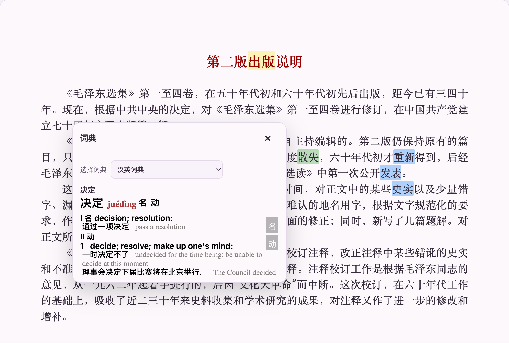
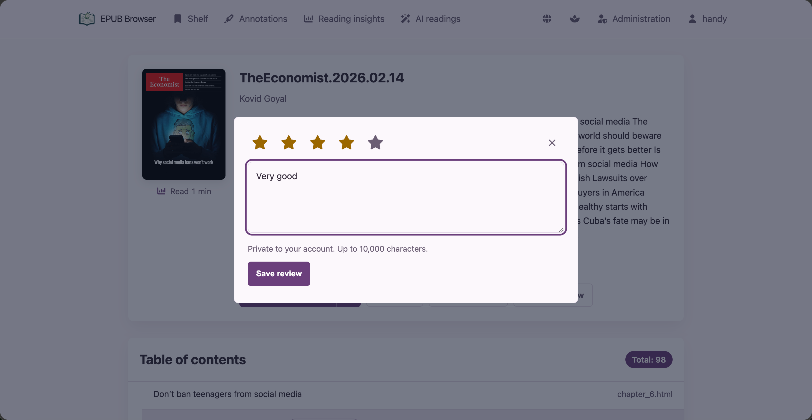
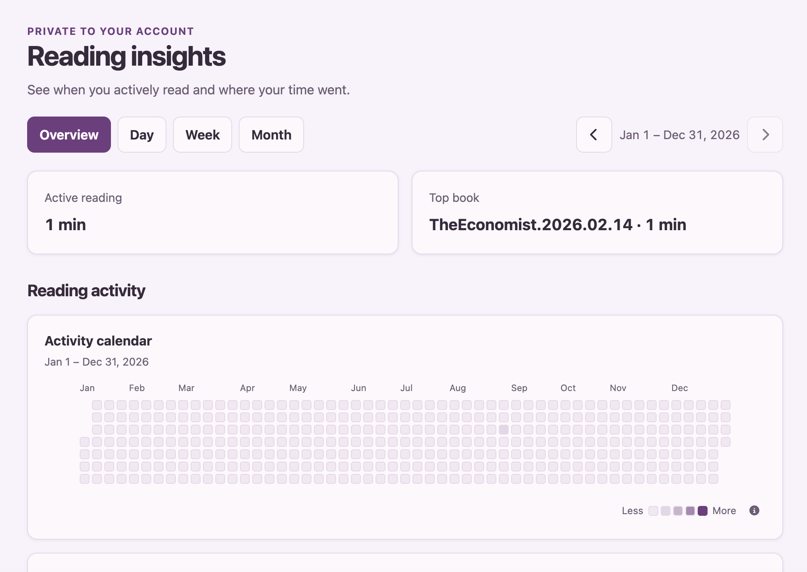

# EPUB Browser v2.4.0 — 本地词典、私密书评与阅读洞察

发布日期 / Release date: 2026-08-26

## 中文

v2.4.0 将 EPUB Browser 从阅读器进一步变成私人的阅读工作台：在 Server 模式中，读者可以从选中文本直接查本地词典或百科，留下只属于自己的书评，并回看真正投入阅读的时间与节奏。

### 新功能

- **本地词典与百科查阅**：登录读者选中文字后，可使用“查词”和“百科”，并继续保留复制、高亮和笔记。查词使用管理员安装的本地词典，即使离线也能工作；百科通过 Wikimedia 提供补充背景信息。
- **兼容 MDict 与 StarDict 词典包**：管理员可导入 MDict ZIP 包（包括 MDX、MDD 及关联的 CSS、图片或脚本）或 StarDict 的 ZIP、tar.gz/tgz、tar.bz2/tbz2 下载包。释义以词典自身格式和资源呈现；对于可信词典，也可在管理后台单独允许其脚本执行。
- **可管理的词典体验**：管理员可启用、停用、重命名、删除词典并指定首次查词的默认词典；读者仍可随时切换到任一启用词典，选择会被记住。

- **私密书评**：每本书都可以留下星级和最多 10,000 字的个人书评。书评只属于当前账户，不会向其他读者或管理员公开。

- **阅读洞察**：阅读器会在你实际停留并阅读时记录时长。洞察页提供总览、日、周、月视图，展示阅读日历、趋势、阅读时段、连续会话和最常阅读的书籍；所有数据仅属于当前账户。

### 改进与修复

- **选区操作更沉浸**：复制不再打断阅读；高亮直接采用默认颜色，笔记沿用精简的颜色选择与编辑流程。查词、百科和标注详情均采用一致的弹窗位置与点击外部关闭行为。
- **标注与管理交互统一**：修复直接打开新建标注可能失败的问题；词典、书籍设置及其他破坏性管理操作均使用站内确认组件，不再调用浏览器原生确认框。
- **阅读统计更可靠**：多标签页会选出一个活跃阅读页来上报，并能在离线、重试、页面切换和跨章节时保持时长连续，避免重复计算。
- **管理员不再受人为导入、批量或 AI 并发上限约束**：资源容量由部署环境决定，适合管理员自行管理的私有书库。

### 升级说明

- Server 首次启动时会自动将 SQLite 状态库迁移到 schema v15；无需手动执行数据库迁移，但生产部署仍建议先备份 `server-dir`。
- 本地词典、书评和阅读洞察均为 **Server 专属** 功能；SSG 输出不会包含账户、词典包或这些 API。
- 无需重新转换 EPUB，也无需提高 Server EPUB 内容缓存修订。更新并重启 Server 即可生效；SSG 部署请重新生成并完整发布输出目录，使新的哈希资源一同上线。
- 词典包及其媒体资源保存在 Server 数据目录中。请将该目录纳入持久卷与备份；仅为来源可信的词典开启脚本执行。

## English

v2.4.0 turns EPUB Browser further into a private reading workspace. In Server mode, readers can look up selected text in local dictionaries or an encyclopedia, keep private reviews, and see when they actually spent time reading.

### New features

- **Local dictionary and encyclopedia lookup**: Signed-in readers can now choose Dictionary or Encyclopedia from the text-selection menu alongside Copy, Highlight, and Note. Local lookup works offline after a dictionary is installed; encyclopedia results add context through Wikimedia.
- **MDict and StarDict packages**: Administrators can install an MDict ZIP package (MDX, MDD, and related CSS, images, or scripts) or a StarDict ZIP, tar.gz/tgz, or tar.bz2/tbz2 download. Definitions retain their native format and resources; scripts can be enabled per trusted dictionary in Administration.
- **Dictionary management and choice**: Administrators can enable, disable, rename, delete, and select the default dictionary. Readers can still switch to any enabled dictionary, and their choice is remembered.

- **Private book reviews**: Add a star rating and a personal review of up to 10,000 characters to any book. Reviews are visible only to the account that created them.

- **Reading insights**: The reader records time only while you are actively reading. Overview, day, week, and month views show an activity calendar, trends, reading periods, continuous sessions, and your most-read book—all private to your account.

### Improvements and fixes

- **A quieter selection workflow**: Copy no longer interrupts reading. Highlight uses the default color immediately, while Note keeps a compact color and editing flow. Dictionary, encyclopedia, and annotation-detail dialogs now share consistent positioning and outside-click dismissal.
- **Consistent annotation and administration interactions**: Fixed an issue that could prevent a newly created annotation from opening immediately. Dictionary, book-settings, and other destructive administration actions now use the in-app confirmation component rather than browser-native dialogs.
- **More reliable reading time**: Multiple tabs elect one active reader. Offline use, retries, page changes, and chapter transitions preserve continuous active time without double counting.
- **No artificial administrator caps**: Dictionary import, batch work, and AI concurrency are now governed by the deployment's available resources rather than application-imposed limits.

### Upgrade notes

- On first Server startup, the SQLite state database automatically migrates to schema v15. No manual migration is needed, though a production `server-dir` backup remains recommended.
- Local dictionaries, private reviews, and reading insights are **Server-only**. SSG output does not include accounts, dictionary packages, or these APIs.
- No EPUB reconversion or Server EPUB-content-cache revision is required. Restart an updated Server deployment to apply the release. For SSG deployments, regenerate and publish the full output directory so all new hashed assets are deployed together.
- Dictionary packages and their media live in the Server data directory. Include that directory in persistent volumes and backups, and enable dictionary scripts only for packages you trust.
